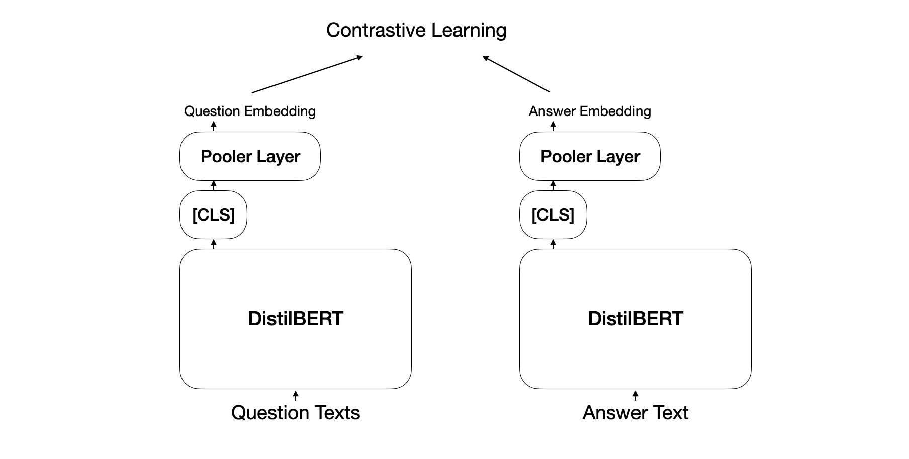

# Finding similar questions via contrastive learning

This repository contains the code to find similar questions using [NQ-Open dataset](https://www.tensorflow.org/datasets/catalog/natural_questions_open). The idea is very simple; similar questions will be answered similarly. The model takes question texts and finds appropriate answers in a contrastive objective.

## Training Strategy

<p align='center'>

</p>

I initialized both encoder using [`distilbert_en_uncased_L-6_H-768_A-12`](https://tfhub.dev/jeongukjae/distilbert_en_uncased_L-6_H-768_A-12/1) model. Both encoders don't share weights.

## Training Log

```text
Epoch 1/5
229/229 [==============================] - 243s 869ms/step - loss: 4.2095 - categorical_accuracy: 0.1693 - top_k_categorical_accuracy: 0.3829 - val_loss: 3.4928 - val_categorical_accuracy: 0.2978 - val_top_k_categorical_accuracy: 0.5795
Epoch 2/5
229/229 [==============================] - 190s 823ms/step - loss: 3.1938 - categorical_accuracy: 0.3609 - top_k_categorical_accuracy: 0.6390 - val_loss: 3.2612 - val_categorical_accuracy: 0.3709 - val_top_k_categorical_accuracy: 0.6335
Epoch 3/5
229/229 [==============================] - 190s 823ms/step - loss: 2.6433 - categorical_accuracy: 0.4968 - top_k_categorical_accuracy: 0.7719 - val_loss: 3.2017 - val_categorical_accuracy: 0.4055 - val_top_k_categorical_accuracy: 0.6676
Epoch 4/5
229/229 [==============================] - 190s 825ms/step - loss: 2.2416 - categorical_accuracy: 0.6077 - top_k_categorical_accuracy: 0.8622 - val_loss: 3.2476 - val_categorical_accuracy: 0.4316 - val_top_k_categorical_accuracy: 0.6753
Epoch 5/5
229/229 [==============================] - 190s 825ms/step - loss: 1.9761 - categorical_accuracy: 0.6892 - top_k_categorical_accuracy: 0.9161 - val_loss: 3.2935 - val_categorical_accuracy: 0.4338 - val_top_k_categorical_accuracy: 0.6784
```

## Search questions in the QQP validation dataset

```text
input sentence: good way to learn another thing
  Score: 0.886190891 , String: "What is the best way to learn?"
  Score: 0.823236644 , String: "What is the best way to learn new words?"
  Score: 0.814555228 , String: "How can I learn something?"
  Score: 0.811604261 , String: "What is the best way to teach a child to read?"
  Score: 0.811584115 , String: "What is the best way to teach yourself to study hard and consistent?"
  Score: 0.806611836 , String: "What is the best way to learn another language by self study?"
  Score: 0.805926919 , String: "What is the best way to learn Chinese?"
  Score: 0.798858523 , String: "How do anyone learn something?"
  Score: 0.795267463 , String: "How can you teach yourself to read?"
  Score: 0.792941034 , String: "What\'s the most effective way to get started with Deep Learning?"

input sentence: how to make money?
  Score: 0.974368513 , String: "How you make money?"
  Score: 0.91104 , String: "What is the best way to to make money?"
  Score: 0.904579699 , String: "How do I make money from home?"
  Score: 0.898456037 , String: "\"\"\"How to make money?\"\"\""
  Score: 0.891534925 , String: "How does Quora make money?"
  Score: 0.889303148 , String: "What are some interesting ways to make money?"
  Score: 0.88772 , String: "How can I make my money make money?"
  Score: 0.879340827 , String: "What is the best way to get money?"
  Score: 0.877755702 , String: "How do I get money from you?"
  Score: 0.874888718 , String: "How can I use Quora to make money?"

input sentence: What is computer engineering?
  Score: 0.875074446 , String: "What is a architecture engineering?"
  Score: 0.866968751 , String: "What is Electrical Engineering?"
  Score: 0.865232825 , String: "What is complexity engineering?"
  Score: 0.846971631 , String: "Why we do study computer fundamental in software engineering.?"
  Score: 0.836921751 , String: "What scopes for production engineering?"
  Score: 0.82852596 , String: "Is computer science an engineering discipline? If so, why is it not called computer science engineering?"
  Score: 0.822983801 , String: "What are the best research topics in manufacturing engineering?"
  Score: 0.822663784 , String: "What is operations research?"
  Score: 0.813095212 , String: "What are the key courses I need to take as an electrical/mechanical engineering major if I want to work in automative systems, power train engineering, battery design or building electronic devices/embedded systems?"
  Score: 0.8123613 , String: "I want to build my career as a robotics engineer.I want to make robots. Which subject should I choose to study in the BSc level?"

input sentence: Who is God?
  Score: 0.999999821 , String: "Who is God?"
  Score: 0.961303771 , String: "What and Who is God?"
  Score: 0.88813591 , String: "Who is God to you?"
  Score: 0.861178577 , String: "If Jesus is God, then who is God?"
  Score: 0.837651968 , String: "Who is the True CHRIST?"
  Score: 0.805844426 , String: "Is there really a god?"
  Score: 0.795654178 , String: "If I define God, than who really is the god?"
  Score: 0.794480264 , String: "God: Can we define God?"
  Score: 0.705521524 , String: "Who created god if god created the Universe?"
  Score: 0.702604175 , String: "What if there is a God?"

input sentence: cpu for mobile
  Score: 0.915927172 , String: "Which processor is best for mobile gaming?"
  Score: 0.900077462 , String: "Which processor is the best for mobiles?"
  Score: 0.870210886 , String: "Which mobile processor is good Mediatek or Snapdragon?"
  Score: 0.850220859 , String: "Which processor is better (faster/more efficient), Snapdragon or Intel Core?"
  Score: 0.845987082 , String: "What is snapdragon processor?"
  Score: 0.844016433 , String: "Which is a better processor for Android: 1.2 GHz or 1.3 GHz?"
  Score: 0.837433398 , String: "Which processor in AMD is equivalent to Intel i3 or i5 (4th generation) in gaming ?"
  Score: 0.832915187 , String: "Which GPU is better for Deep Learning, GTX 1080 or Tesla K80?"
  Score: 0.829033136 , String: "What is a faster phone for heavy multitasking: One with 1.1ghz quad core CPU and 2gb of RAM, or 1.3 quad core CPU and only 1gb of RAM?"
  Score: 0.817965508 , String: "Which chip set is better, MediaTek, Intel Atom or Snapdragon?"

input sentence: x^2
  Score: 0.888256669 , String: "What is (X/2)^2?"
  Score: 0.775948286 , String: "What is (X^(2)) * (X^(1/2))?"
  Score: 0.770053267 , String: "If x is tripled, is it 3x or x^3?"
  Score: 0.756016493 , String: "What will be the expansion of (x+1) ^(1/x)?"
  Score: 0.734183609 , String: "How can I solve for x? 5^ (log_(3) (2x))-x<3"
  Score: 0.70823884 , String: "What does this symbol -^- mean?"
  Score: 0.701890886 , String: "What is the derivative of x^2sinx?"
  Score: 0.681457102 , String: "In CSS what\'s the difference between ^= and |=?"
  Score: 0.679469585 , String: "What is derivation Of E=mc^2?"
  Score: 0.676228523 , String: "How is the graph of y = 2 x^2?"
```
